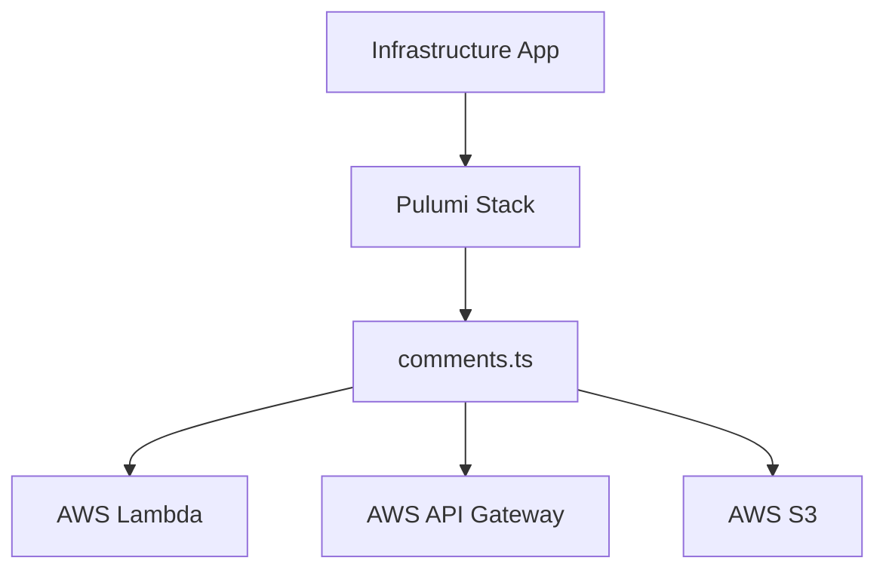

The Infrastructure app manages deployment, configuration, and cloud resources for the Comments platform using Pulumi and TypeScript.

- **Location:** `/apps/infrastructure`
- **Tech Stack:** Pulumi, TypeScript
- **Cloud:** AWS (via Pulumi)
- **Internal Packages:** Uses `@repo/shared-types` and utility modules from `/packages`

---

## Architecture Overview



---

## Tooling

- **Pulumi:** Infrastructure as Code for provisioning AWS resources
- **TypeScript:** Strong typing and code sharing with app and package code.
- **Utilities:** Custom helpers in `/apps/infrastructure/utils` for resource definitions and type safety.

---

## Main Files & Structure

- `index.ts`: Main entry for Pulumi stack definitions.
- `comments.ts`: Defines resources related to the Comments API (e.g., Lambda, API Gateway).
- `Pulumi.yaml`, `Pulumi.dev.yaml`: Pulumi project and stack configuration.
- `utils/`: Shared utility functions and types.

---

## Internal Packages

- **`shared-types`**: Provides common types for resources and configuration.
- **`typescript-config`**: Shared TypeScript configuration for consistent builds.

---

## Example Pulumi Resource

```ts
import * as aws from '@pulumi/aws'

const bucket = new aws.s3.Bucket('comments-assets')
```

---

## Further Reading

- [Pulumi Documentation](https://www.pulumi.com/docs/)
- [TypeScript Documentation](https://www.typescriptlang.org/docs/)
